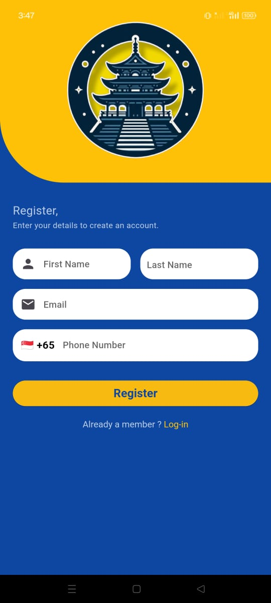

# Sukio Mahikari

## Introduction

Sukio Mahikari for member is a Community App designed to streamline the check-in and check-out process for community events and gatherings. With our intuitive QR code scanning feature, managing attendance has never been easier.

## Prerequisites

## Getting Started

- If you have no account you need to register

 

-----

## Key Features

- **QR Code Check-In/Check-Out**: Simplify attendance tracking for community events. Participants can check in and check out by scanning event-specific QR codes using their smartphones.
  
- **Real-time Attendance Monitoring**: Stay updated with real-time attendance data to manage events more effectively.

- **User-Friendly Interface**: Our app ensures a seamless experience for both organizers and participants with clear instructions and intuitive design.

- **Event Management Tools**: Beyond attendance tracking, our app offers event management tools for registration and communication with attendees.

## How It Works

1. **Event Setup**: Organizers create events and generate unique QR codes for check-in/check-out.
  
2. **Participant Check-In**: Participants scan the QR code using their smartphones upon arrival to check in.
  
3. **Real-time Tracking**: Organizers monitor attendance in real-time through the app's dashboard.
  
4. **Check-Out**: Participants scan the QR code again upon leaving to check out and complete their attendance record.

## Getting Started

To get started with [Your Application Name], follow these steps:

1. Clone this repository:

