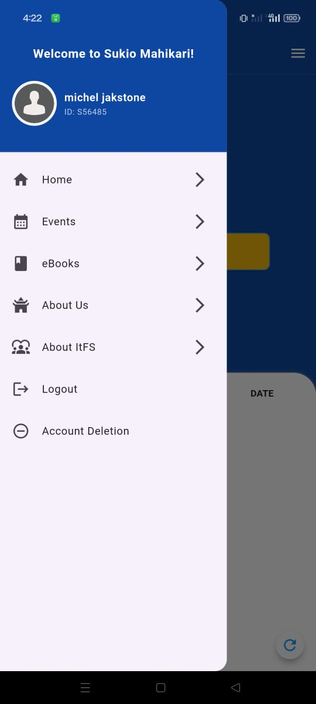

# Sukio Mahikari

## Introduction

Welcome to Sukio Mahikari, the ultimate Community App for members designed to streamline the check-in and check-out process for community events and gatherings. With our intuitive QR code scanning feature, managing attendance has never been easier.

## Prerequisites

## Getting Started

To get started with Sukio Mahikari, follow these steps:

1. **Register for an Account**: If you don't have an account yet, you need to register.
   
    

        
    

    Make sure to fill out the required information accurately to create your account.

2. **Verify Phone Number**: After registering, you'll need to verify your phone number. This step helps ensure the security of your account and allows us to send you important notifications.

    

        
    

3. **Successful Register**: Once you have successfully registered, there will be a pop-up dialog indicating that your membership request is pending approval by the administrator. Please wait patiently for approval.

    

        
    

4. **Login**: After your account has been approved by the administrator, you can log in using your mobile number and One-time-password (OTP). The OTP will be sent to your registered mobile number. Enter the OTP to complete the login process.

    

        
        
    

5. **Access to Dashboard**: After logging in, you can access the dashboard where you can browse through the list of community events and gatherings available. You can view event details, such as date, time, and other features, especially the check-in and check-out functionalities.

    

        
        
    

6. **Check-In/Check-Out**: Upon attending an event, use our QR code scanning feature to check in. Scan the event's unique QR code upon arrival and scan again when leaving to check out. 

## How to use the Check-In/Check-Out

- **QR Code Check-In**: To check in at an event, follow these steps:
  1. Click the "Check-In" button on your dashboard.
  2. The app will activate the camera for scanning the event's QR code.
  3. Hold your device steady and position it to scan the QR code displayed at the event venue.
  4. Once the QR code is successfully scanned, you will be checked in to the event.

    

        
        
        
    

    If you accidentally scan again the check-in qr it will show an error message indicating that you have already checked in.

    

        
    

  
- **Real-time Attendance Monitoring**: Stay updated with real-time attendance data.
  
- **User-Friendly Interface**: Enjoy a seamless experience with clear instructions and intuitive design.

## Support and Contact

For support or inquiries, please contact [Your Contact Information].

## Acknowledgements

[List any acknowledgements or credits here, such as libraries or resources used.]

## License

[Specify the license under which the project is distributed. For example, MIT License, Apache License 2.0, etc.]
